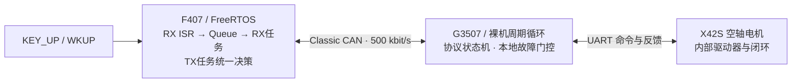

# 双 ECU 车窗执行器控制原型

**STM32F407 · FreeRTOS · Classic CAN · MSPM0G3507 · UART 电机反馈**

[](https://github.com/zejun051019/DualECU-Window-CAN-FreeRTOS/actions/workflows/host-checks.yml)

用一套双节点台架模拟车窗升降：**F407 处理按键和通信请求，G3507 执行本地故障门控，再通过 UART 控制 X42S 闭环步进电机。** 当前演示使用空轴，以相对 90° 行程呈现升降、停止与回程。

**快速审阅：** [任务与共享资源](docs/architecture.md) · [协议与显式恢复](docs/protocol.md) · [真实排障案例](docs/debugging-case.md) · [台架数据](docs/verification.md)。下方“工程重点”表将每项设计连接到对应源码。

## 功能演示

| 操作 | 台架行为 |
|---|---|
| 长按 F407 的 KEY_UP / WKUP 约 2.5 秒，松开 | 显式恢复并建立临时软件零点；轴保持静止 |
| 设零后短按一次 | 向上端运动，约 90° 后停止 |
| 到上端后再短按 | 回到下端并停止 |
| 运动过程中短按 | 中途 STOP，不自动续动 |
| 中途停止后再短按 | 以新操作返回下端 |

设零基准保存在 RAM。复位、故障或电机重新上电后的恢复流程从 STOP 开始：原因解除后长按完成握手并重新设零，轴不动；再以新短按运动。已有行程也可在静止、反馈有效且无故障时通过新的长按重设。长按后紧接的新短按可限期等待本次恢复/设零确认，仅执行一次；离线、故障、STOP 或超时会取消该意图。



## 工程重点

| 设计 | 解决的问题 | 源码入口 |
|---|---|---|
| ISR 有界取帧，Queue 按值复制，接收时刻随帧传递 | 中断不等待；积压的旧状态不能被误当成刚收到 | [F407 CAN 应用](firmware/f407/App/Src/app_can_physical.c) |
| TX 任务统一管理目标和序号，STOP 独立锁存 | 满队列、并发操作和旧待发运动不能覆盖 STOP | [请求管理](shared/window_request.c) |
| 版本、DLC、序号、重复/冲突/回绕检查 | 区分合法报文、新操作和允许执行的动作 | [协议编解码](shared/can_protocol.c) |
| STOP → CLEAR → STOP，匹配新鲜状态确认 | CAN 发送成功不等于业务执行；清错不自动运动 | [恢复客户端](shared/can_recovery_client.c) |
| 执行端周期检查失联、反馈与故障 | 本地保护不依赖另一块 MCU 或下一帧到达 | [执行端状态机](shared/window_state.c) |
| 总线恢复与业务恢复分开 | 硬件恢复通信不解锁运动；撤销旧待发帧，仍需显式握手与新操作 | [G3507 CAN 端口](firmware/g3507/user/can_port_mspm0.c)、[恢复流程](docs/architecture.md#通信恢复与业务恢复) |
| 有限小段运动、位置反馈与软件行程 | 每段都重新检查门控；停止后不重放旧目标 | [演示规划器](shared/window_demo.c)、[UART 电机端口](firmware/g3507/user/zdt_uart_mspm0.c) |

电机内部完成闭环控制；本项目实现的是跨节点请求、反馈监督、任务协作与故障处理。

## 实测结果

2026-10-02 恢复更新版经同一按键处理器的调试事件，完成 CAN→UART 实物运动：临时范围 **0°–90°**，上升终点反馈 **89.5°**，回程 **0.7°**；中途 STOP 在 **11.2°**并保持，新操作返回 **0.6°**，最终为 `STOP / NONE`。随后操作者反馈实体按键“可以了”，配对快照显示按键事件增加、F407 拒绝计数为0、CAN在线、电机静止；此复测没有逐键位置轨迹。前一版本的完整实体按键轨迹也保留在[验证记录](docs/verification.md)。

- **14 组项目主机检查**覆盖协议、序号、恢复、超时回绕、请求锁存、按键、行程、演示规划与 UART 解析。
- 两端工程从公开目录独立构建，保留 `.ioc`、`.syscfg`、生成代码和厂商许可声明。
- 新版记录覆盖执行端 MCU 复位及软件设备错误后的显式恢复、静止重新设零；保留前版失联、反馈丢弃记录，并分别注明版本与输入方式。

位置来自电机驱动器反馈。本项目是空轴控制原型，不代表实车车窗、防夹或量产汽车 ECU。台架曾出现间歇 CAN Bus-Off；新版加入非阻塞总线恢复和本地 STOP 门控，物理触发根因尚未确定。实测结果仅支持各自记录的运行窗口，详见[验证范围](docs/verification.md#验证范围)。

## 读代码与复现

- [架构与 FreeRTOS 设计](docs/architecture.md)
- [CAN 协议与恢复流程](docs/protocol.md)
- [接线、构建、下载与运行](docs/build-and-run.md)
- [功能与故障验证记录](docs/verification.md)
- [排障案例：设零确认与通信恢复](docs/debugging-case.md)
- [厂商代码许可说明](NOTICE.md)

```text
firmware/f407/       F407 HAL、FreeRTOS、应用及 CubeMX 配置
firmware/g3507/      G3507 DriverLib、UART 电机端口及 SysConfig 配置
shared/             协议、状态机、恢复、行程和演示规划
tests/host/         可在 PC 运行的 C 检查
tools/              主机检查与下载入口
docs/               架构、协议、复现步骤与实测数据
```

开发方式：作者提供硬件台架、确认需求并完成现场按键/轴动作观察；代码实现和部分调试使用 AI 辅助。仓库中的验证记录用于追溯工程结果。
