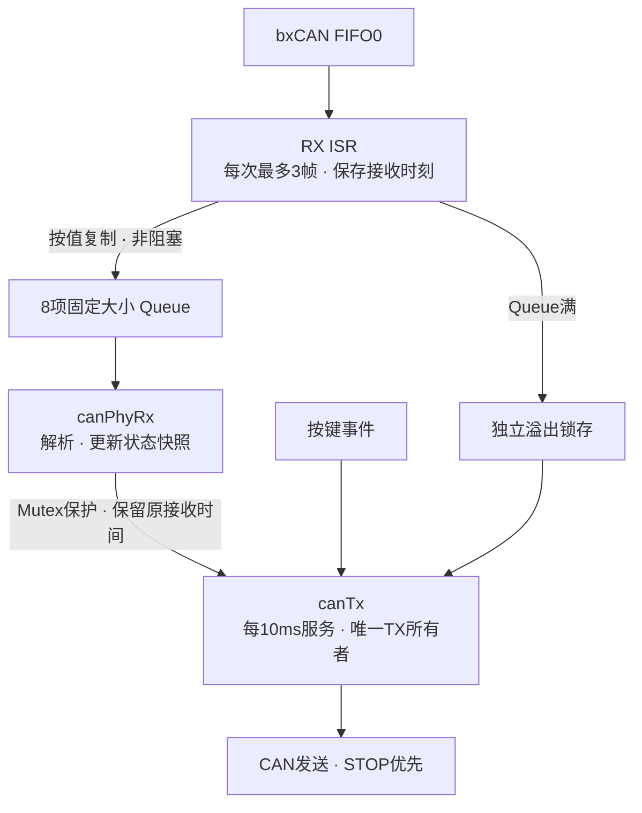

# 架构与 FreeRTOS 设计

## 两端职责

F407 运行 FreeRTOS V10.3.1，使用 CMSIS-RTOS2 接口、GCC ARM_CM4F 端口与 heap_4。它负责输入、协议客户端和 CAN 收发。G3507 运行裸机周期循环，拥有执行端状态和电机命令，按本地时间检查故障。

## 任务、资源与中断边界

| 上下文 | 实际工作 | 配置 |
|---|---|---|
| CAN RX ISR | 有界复制、时间戳、计数和非阻塞 Queue 投递 | NVIC 优先级5；每次最多3帧 |
| `canPhyRx` | 阻塞等待 Queue，校验并发布状态快照 | BelowNormal；512 B 栈 |
| `canTx` | 按键、目标/序号、离线、STOP、发送和恢复 | Normal；每10 ms；512 B 栈 |

Tick 为1 kHz；HAL 时基使用 TIM6。Heap 配置为15360 B。NVIC 分组为 GROUP_4，4位抢占优先级；`configLIBRARY_MAX_SYSCALL_INTERRUPT_PRIORITY=5`，内核移位值为 `0x50`。本地 CMSIS 适配层在 ISR 调用 `osMessageQueuePut(..., 0)` 时使用 FromISR 分支及必要的调度请求。

## 所有权与故障优先级

- TX 任务唯一拥有请求、目标、seq 和发送决策；RX 任务发布带接收时刻的状态快照。
- 状态快照用 Mutex 保护；ISR 共享锁存的操作使用与 IRQ 边界匹配的临界区，`volatile` 只提供可观察性。
- Queue 满时独立锁存并暂停 FIFO pending 通知；TX 直接检查锁存建立 STOP，后续排空和原因清除再按流程恢复通知。
- 旧状态的年龄从 ISR 接收时刻计算，不从出队时刻计算。
- 发送采用最新请求合并，不积存历史运动；恢复前清理旧目标。
- 运行期 CAN/控制路径不打印阻塞式日志，观察字段通过调试器读取。

## 执行端

[window_can_app.c](../firmware/g3507/user/window_can_app.c) 连接 MCAN、协议状态、演示目标和 UART 电机端口；[window_state.c](../shared/window_state.c) 执行失联、序号与锁存门控；[window_demo.c](../shared/window_demo.c) 规划 RAM 范围内的小段目标。

每段动作结束后重新检查反馈和门控，再考虑下一段。普通 UP/DOWN 仍是有限单步；演示事件使用同一底层保护链路。STOP、故障与失联优先于普通运动；反馈恢复或通信重连不能自行重放旧运动。

当 UART 链路失效时，软件 STOP 可能无法送到电机。有限目标限制已发送的运动范围，不能视作独立硬件切断能力。
