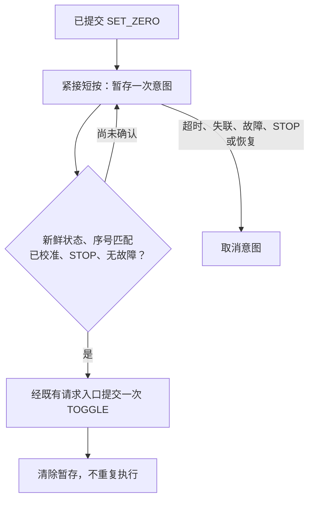

# 排障案例：从按键意图到通信恢复

## 案例一：设零尚未确认，紧接的短按被拒绝

这个案例对应 F407 按键应用与 G3507 设零确认之间的交互。代码实现与调试使用 AI 辅助；操作者完成实体按键和轴动作观察。它说明如何从事件、通信与业务状态分别定位问题。

### 现象与定位

预期操作是长按 KEY_UP 设零，松开后立即短按上升。设零需要执行端的可用位置反馈，并通过状态报文确认；F407 发出 `DEMO_SET_ZERO` 时，执行端并不一定已经完成设零。

旧逻辑在等待设零确认期间保留 `s_button_pending_command`。这时短按即使已被识别成 `APP_BUTTON_TOGGLE`，仍可能在“有命令待确认”的分支被拒绝，没有后续执行机会。这是源码可以确认的交互缺口。

现场也曾出现 CAN Bus-Off 导致请求被拒绝。必须先检查链路，不能把所有“电机不动”归因于按键或这个缺口。

| 检查位置 | 观察什么 | 支持的判断 |
|---|---|---|
| F407 按键入口 | `g_can_physical_button_event_count`、`g_can_physical_button_last_event`、`g_can_physical_button_rejected_count` | 按键是否被识别；事件是否在应用层被拒绝 |
| F407 接收快照与 CAN 错误状态 | `snapshot.received_at_ms`、远端离线标志、CAN ESR；G3507 MCAN PSR/ECR | 状态是否新鲜、链路是否可用；不能用旧状态证明在线 |
| F407 待确认命令 | `s_button_pending_command`、`s_button_pending_sequence` 与 `snapshot.status.last_sequence`、`is_calibrated` | 是否仍在等同一次设零请求的确认 |
| G3507 业务与 UART 反馈 | 设零计数、行程有效位、state/fault、位置反馈和活动运动标志 | 请求是否真正执行；发送成功不能替代业务确认 |

字段入口是 [F407 按键服务](../firmware/f407/App/Src/app_can_physical.c#L1356)。调试器读取前，应核对加载的 ELF 与实际刷入镜像；暂停采样也会影响实时运行，读取结果需结合原始记录判断。

### 最小修改

只在本次设零请求待确认、状态仍安全时，暂存一次短按意图，最长等待 **1500 ms**。既有 CAN 帧字段与 STOP/CLEAR 语义保持不变。

- [暂存、取出与取消实现](../firmware/f407/App/Src/app_button.c#L88)：时间差使用无符号减法，覆盖计数回绕；成功取出后先取消，防止重复。
- [F407 集成](../firmware/f407/App/Src/app_can_physical.c#L1356)：检查新鲜状态、对应设零序号、校准位和 STOP 门控；故障、离线、STOP 或恢复丢弃旧操作。新版只允许本次显式恢复之后的新短按有限期等待，不保留故障前的动作。
- [G3507 命令处理](../firmware/g3507/user/window_can_app.c#L579)调用[行程设定](../firmware/g3507/user/zdt_uart_mspm0.c#L118)：检查反馈就绪、到位、无活动/待处理运动，再以当前位置建立 RAM 范围；新版允许新的长按重设已有静止范围。另一个[电机故障恢复后的重新设零路径](../firmware/g3507/user/window_can_app.c#L982)还要求至少三份稳定位置反馈，覆盖至少 200 ms；不能把它与普通设零混为同一条件。

这个暂存槽只服务于同一次设零交互，不积存多个历史运动，也不能跨故障或复位自动重放。运动中按键仍优先 STOP。

### 复核与结果

[按键主机用例](../tests/host/app_button_test.c#L94)检查未校准、序号不匹配、匹配后仅执行一次、故障取消、1500 ms 期限及时间回绕。它们属于 PC C 检查，不代表实物按键与电机验收。

前一发布版本的2026-10-02实体按键记录对应以下镜像，保留用于追溯；当前版镜像另见[验证记录](verification.md)：

| 节点 | ELF SHA-256 |
|---|---|
| F407 | `AE8EB936260BDC85D77E6AC0F05BAF59868FCFBD8518EB9D67368B4C420D7595` |
| G3507 正式 | `32CDA168C136B6F8FCB8B3F46086E15D43707D73702E0FF19EB3A05FDFE918D2` |

操作者长按后紧接短按，两端记录显示设零范围 `[1.0°, 91.0°]`，上升终点反馈 90.5°；再短按回到 1.5°；运动中再按停止于 18.1°，新短按返回 1.8°。四段按键拒绝计数为 0，最终均为 `STOP / NONE`，详见[版本绑定的验证记录](verification.md)及其样本。

现场轨迹证实完整交互可用，不能据此推断每次运行都进入暂存分支；期限、取消与单次执行的边界由主机用例核对。该修正也不表示间歇 CAN Bus-Off 根因已修复，或已完成真实线缆断开、机械停止时延与实车安全验证。

### 这个案例体现的工程判断

1. 把输入事件、报文发送、状态确认和电机动作分开观察，先找阻断请求的层。
2. 为确认延迟保留一次有期限的意图，同时保持 STOP 与故障优先。
3. 用小范围应用修正解决交互，不放宽底层保护，也不把重连当作恢复旧动作的理由。

## 案例二：按键已识别，但通信和故障锁存阻挡运动

### 现象 → 假设 → 观察

现场表现是再次上电或故障测试后，短按电机不动，反复复位才可能恢复。假设分别检查输入识别、CAN通信、执行端故障和电机反馈，而非直接放宽运动门控。

| 实际观察 | 判断 |
|---|---|
| F407按键事件与拒绝计数均为6 | 已有事件进入应用，不能只查按键时长 |
| G3507 `CCCR=1`、`PSR=0x7E4`、`ECR=0x2000F8`，RX不增长 | MCAN处于Bus-Off，需要硬件恢复服务 |
| F407 `ESR=0x00800033`、offline=1、STOP latch=1 | 无新鲜对端确认，拒绝运动符合保护逻辑 |
| G3507 `STOP/MOTOR_LOCAL`、保留E2错误、range invalid | 即使恢复通信，仍需要原业务握手及新设零 |
| UART新回包增长、反馈约11.4 V、位置约0° | 当时电机链路仍活跃，不支持直接归因于电池没电 |

### 判断 → 最小修改

确认的缺口是“总线恢复服务缺失”和“通信停止锁存未接入长按恢复”。间歇Bus-Off的物理触发根因尚未确定，不能把恢复路径修正当作根因结案。

1. [G3507 CAN端口](../firmware/g3507/user/can_port_mspm0.c#L144)在每轮服务中检查Bus-Off、撤销旧待发帧、按间隔尝试硬件异步恢复。恢复期间不阻塞保护，不继续普通发送。
2. [执行端](../firmware/g3507/user/window_can_app.c#L1097)立即本地STOP、取消演示并作废范围；F407开启硬件自动Bus-Off恢复。总线恢复后依然不运动。
3. [长按恢复决策](../firmware/f407/App/Src/app_button.c#L77)覆盖已确认的通信停止锁存；复用原STOP→CLEAR→STOP握手，再请求设零。新的静止长按可重设范围，故障前目标不会复活。
4. 把原上电1000帧诊断改为默认OFF的构建项，保留诊断能力，避免演示按键约十秒内被诊断阶段阻挡。

### 复验

新增主机用例检查Bus-Off本地STOP、旧UP拒绝、原握手后仍不运动和长按恢复门控；项目14组检查通过。当前配对镜像完成升降/中途STOP、执行端MCU复位及软件E2故障后的恢复，操作者随后确认实体按键可用。另有17份连续状态快照覆盖约291.5秒，CAN计数持续增长、未观察到再次Bus-Off，详见[当前版本数据与边界](verification.md)。

本案例保留“输入识别 → 硬件链路 → 状态确认 → 本地门控 → 电机反馈”的排查顺序。恢复尝试计数、恢复完成计数和业务执行计数分别观察，避免把“能发帧”当成“允许运动”。
