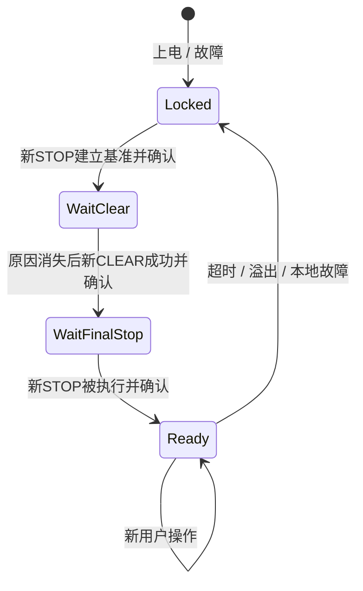

# CAN 协议与恢复

实体链路采用 Classic CAN、11位标准数据帧、500 kbit/s。G3507 的 MCAN 禁用 FD/BRS。编解码及枚举见 [can_protocol.h](../shared/can_protocol.h) 和 [can_protocol.c](../shared/can_protocol.c)，当前版本为4。

## 报文

| 方向 / ID | DLC | 数据字节 |
|---|---|---|
| F407 → G3507 / `0x100` | 4 | `[version, seq, command, reserved=0]` |
| G3507 → F407 / `0x180` | 8 | `[version, last_seq, state, fault, position_lo, position_hi, flags, reserved=0]` |

命令为 STOP(0)、UP(1)、DOWN(2)、CLEAR_FAULT(3)、DEMO_SET_ZERO(4)、DEMO_TOGGLE(5)。状态为 STOP(0)、UP(1)、DOWN(2)。故障为 NONE(0)、STARTUP_LOCKED(1)、COMM_TIMEOUT(2)、CAN_RX_OVERFLOW(3)、MOTOR_LOCAL(4)。

位置字段为小端软件行程值0–1000；未建立软件范围时为 `0xFFFF`。Flags 的 bit0 是校准有效、bit1 是 last_seq 有效、bit2 是 RX 溢出原因仍活动，其余位必须为0。扩展帧、远程帧、错误版本/DLC/枚举/保留位会被拒绝。

## 序号与业务确认

8位序号按模256差值分类：同号同命令是重复，同号不同命令是冲突，差值1–127是新操作，128拒绝，129–255是旧操作。重复报文不追加电机运动；非法报文不刷新通信看门狗。

硬件 ACK、发送 API 成功、应用解析成功和业务执行成功分别观察。状态确认必须匹配本次请求序号且来自新鲜接收时刻，不能使用发送前已有的状态或积压旧帧。

## 显式恢复

清错只解除门控，不启动运动。CLEAR 失败仍消费其序号，相同序号重发不会因条件变化变成新尝试。恢复后需要新的用户操作；总线恢复和任务恢复都不重放旧运动。

执行端按本地时间检查命令超时，超过 [WINDOW_STATE_COMMAND_TIMEOUT_MS](../shared/window_state.h) 即 STOP/锁存。接收时刻与处理时刻分开，时间差使用无符号回绕计算。8位 seq 不提供跨复位防重放、任意多圈唯一性或发送端任务活性保证。
